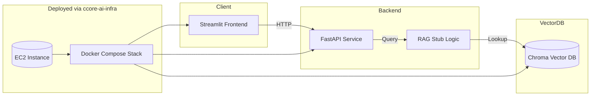

<p align="center">
  
  
  
  
</p>

# CCore-AI Demo

Application layer of the **CCore-AI** stack.

This repository demonstrates a clean, production-ready demo environment built with modern DevOps and AI application practices.

## Features

- FastAPI backend
- Streamlit frontend
- Chroma vector database
- Fully containerized services (Docker)
- CI/CD pipelines (GitHub Actions → GHCR)
- Ready for deployment on the infrastructure created in **ccore-ai-infra**

## Tech Overview

This demo follows the same architectural principles used in production AI systems:

### Backend (FastAPI)

- Modular route structure
- Clear separation between API layer, service layer and configuration
- Deterministic, container-based builds using Poetry
- Healthcheck endpoint for orchestration and monitoring

### Frontend (Streamlit)

- Lightweight, interactive interface to test end-to-end flows
- Direct integration with the backend service
- Zero local dependencies — fully dockerized

### Vector Database (Chroma)

- Local development vector DB for structured retrieval examples
- Demonstrates RAG-style data flow without exposing proprietary logic

### Containers & DevOps

- Backend and frontend use isolated Dockerfiles with `.dockerignore`
- CI builds and scans images in GitHub Actions
- Images pushed automatically to GHCR
- Production deploy is a pull-based workflow (zero local builds on server)

### Infrastructure Integration

- Designed to work with the Terraform + Ansible stack in **ccore-ai-infra**
- EC2 serves as the orchestrator for the full Docker Compose application
- Clean separation between application and infrastructure layers

This mirrors real-world DevOps + AI engineering workflows and demonstrates how to structure a reproducible, container-first environment.

## Architecture (Mermaid Diagram)



## Run Locally

Development environment:

```bash
docker compose -f compose/docker-compose.dev.yml up --build
```

Backend: http://localhost:8000  
Frontend: http://localhost:8501

## Production Deployment (via ccore-ai-infra)

- CI/CD builds and pushes Docker images to GHCR
- EC2 instance pulls updated images
- Docker Compose restarts the full stack

No code is built on the server — deployment is pull-based and container-driven.

## Notes

This repository contains **stub implementations only**:

- no real RAG logic
- no private datasets
- no business or proprietary components

The purpose is to demonstrate structure, architecture, and workflow — not application complexity.
