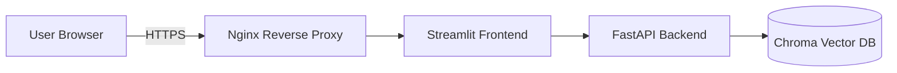
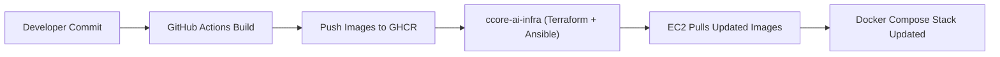

# CCore-AI Demo Application

<p>
  
  
  
  
</p>

<p>
  
  
</p>

Application layer of the **CCore-AI** stack.  
This repository provides a clean, production‑ready containerized demo aligned with the infrastructure in **ccore-ai-infra**.

---

## 1. Prerequisites

- Docker ≥ 24
- Docker Compose plugin
- GitHub Actions enabled for automated CI builds
- GHCR access (public images by default)

---

## 2. Features

- FastAPI backend
- Streamlit frontend
- Chroma vector DB
- Fully containerized
- CI pipelines → GHCR images
- Seamless deployment via **ccore-ai-infra**

---

## 3. Technology Overview

### 3.1 Backend (FastAPI)

- Modular architecture
- Clear separation between API, services, config
- Deterministic builds using Poetry
- Healthcheck endpoint for orchestration

### 3.2 Frontend (Streamlit)

- Lightweight interactive UI
- Directly communicates with the backend
- Zero local dependencies — fully dockerized

### 3.3 Vector Database (Chroma)

- Local RAG‑style retrieval example
- No proprietary datasets included

### 3.4 DevOps & Containers

- Separate Dockerfiles for backend & frontend
- CI builds both images and pushes to GHCR
- Production deployment is **pull‑only** on EC2

---

## 4. Architecture (High-Level)



> Full detailed architecture: `diagrams/app-architecture.mmd`

---

## 5. Deployment Pipeline



---

## 6. Running Locally

```bash
docker compose -f compose/docker-compose.dev.yml up --build
```

Frontend accessible at:  
http://localhost:8501

---

## 7. Production Deployment (via ccore-ai-infra)

- GitHub Actions builds & pushes images
- EC2 pulls latest images
- Docker Compose restarts automatically
- No server-side builds
- Terraform + Ansible handle full orchestration, SSL, directories, configs

---

## 8. Integration with ccore-ai-infra

Terraform provisions EC2 + networking.  
Ansible:

- Installs Docker Engine
- Generates Docker Compose configuration
- Pulls GHCR images
- Runs the application stack

Images used:

- `ghcr.io/laurisneimanis/ccore-ai-demo-backend:latest`
- `ghcr.io/laurisneimanis/ccore-ai-demo-frontend:latest`

---

## 9. Security & Best Practices

- Deterministic CI builds
- No secrets on EC2
- HTTPS termination via infrastructure layer
- Backend never exposed publicly
- GHCR authentication handled by CI

---

## 10. Notes

This repository contains **demo implementations only**:

- No real RAG logic
- No proprietary data
- No business-critical components

Purpose: demonstrate structure, architecture and workflow.

---

## License

MIT License.
