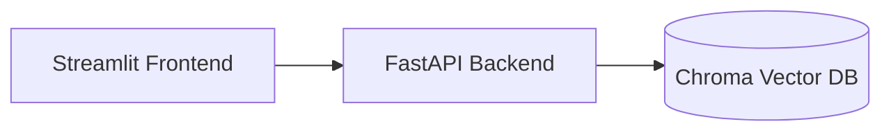
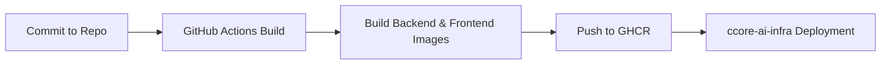

# CCore-AI Demo Application

<p>
  
  
  
  
</p>

<p>
  
  
</p>

Application layer of the **CCore-AI** stack.  
This repository contains a fully containerized backend + frontend demo used by the
infrastructure project **ccore-ai-infra**.

---

## 1. Prerequisites

- Docker ≥ 24
- Docker Compose plugin
- GitHub Actions enabled for CI
- GHCR (images are public)

---

## 2. Features

- **FastAPI** backend
- **Streamlit** frontend
- **Chroma** vector DB (local demo mode)
- Clean Dockerfile separation (backend / frontend)
- GitHub Actions → GHCR build pipelines
- Production deployment is **pull-only** (no builds on EC2)

---

## 3. Technology Overview

### 3.1 Backend (FastAPI)

- Modular structure (API / services / config)
- Healthcheck endpoints for orchestration
- Deterministic builds via Poetry

### 3.2 Frontend (Streamlit)

- Minimal interactive UI
- Direct API communication
- Zero local dependencies (Docker only)

### 3.3 Chroma Vector Database

- Embedded vector store
- Basic RAG-style retrieval example
- No proprietary datasets

### 3.4 DevOps & Containers

- Separate backend + frontend Dockerfiles
- CI builds → GHCR images
- Production uses pull-based updates from **ccore-ai-infra**

---

## 4. Architecture (Repository-Local)



> Nginx reverse proxy is added only at the infrastructure layer  
> (see `ccore-ai-infra` repo).

---

## 5. CI / CD Pipeline



Production server never builds containers —  
it only **pulls** the latest images defined here.

---

## 6. Local Development

Run locally:

```bash
docker compose -f compose/docker-compose.dev.yml up --build
```

Frontend available at:

```
http://localhost:8501
```

Backend available at:

```
http://localhost:8000
```

---

## 7. Production Deployment (via ccore-ai-infra)

- Terraform provisions AWS infrastructure
- Ansible installs Docker Engine
- Ansible deploys a Docker Compose stack that pulls:

  - `ghcr.io/laurisneimanis/ccore-ai-demo-backend:latest`
  - `ghcr.io/laurisneimanis/ccore-ai-demo-frontend:latest`

- Nginx HTTPS termination and directory layout are handled by the infra project

🔗 Infrastructure repo:  
https://github.com/LaurisNeimanis/ccore-ai-infra

---

## 8. Security & Best Practices

- Deterministic CI builds
- No secrets baked into images
- Backend not exposed publicly (proxy-only architecture)
- HTTPS termination handled by infra
- GHCR authentication handled via GitHub Actions

---

## 9. Purpose

This repository provides a **clean demonstration** of:

- API + UI separation
- Containerized app design
- CI → image pipeline
- Integration with an IaC-controlled infrastructure stack

No production datasets or business logic included.

---

## License

MIT License.
