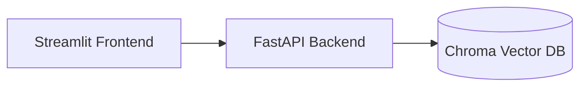
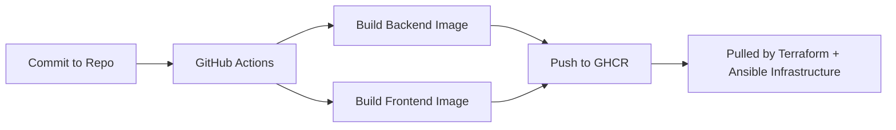

# CCore-AI Demo Application

This repository contains the **application layer** (backend + frontend) for the  
**CCore-AI infrastructure stack**, deployed through the companion project  
`ccore-ai-infra`.

The design follows clean DevOps principles:

- strict backend / frontend separation  
- deterministic Docker image builds  
- CI → GHCR publishing  
- production deployments are **pull-only** (no builds on servers)  
- fully compatible with the Terraform + Ansible automation layer  

This repository intentionally stays lightweight and infrastructure-agnostic.

---

## 1. Repository Structure

```
ccore-ai-demo/
├── backend/                     # FastAPI backend
│   ├── app/                     # API source code
│   ├── Dockerfile
│   └── requirements.txt
│
├── frontend/                    # Streamlit frontend
│   ├── app.py
│   ├── Dockerfile
│   └── requirements.txt
│
├── compose/
│   └── docker-compose.dev.yml   # Local development compose stack
│
├── docker-compose.yml           # Prod/main compose (infra layer consumes)
├── .github/workflows/           # CI pipelines (backend + frontend image builds)
│   ├── build-backend.yml
│   └── build-frontend.yml
│
├── .env.example
└── README.md
```

---

## 2. Technology Stack

### Backend — **FastAPI**
- Clear modular API structure  
- Healthcheck endpoints  
- Lightweight request handling  
- Fully containerized

### Frontend — **Streamlit**
- Minimal UI for interacting with backend  
- Zero local Python dependencies (Docker only)  

### Vector Database — **Chroma**
- Embedded vector store  
- Demonstrates basic RAG-style retrieval  
- Runs in local-only mode for demo purposes  

### Containers & DevOps
- Separate Dockerfiles for backend & frontend  
- GitHub Actions build pipelines  
- Images pushed to GHCR under:
  - `ghcr.io/laurisneimanis/ccore-ai-demo-backend:latest`
  - `ghcr.io/laurisneimanis/ccore-ai-demo-frontend:latest`

**Production NEVER builds images on EC2** — images are pulled only.

---

## 3. Local Development

Run backend + frontend locally:

```bash
docker compose -f compose/docker-compose.dev.yml up --build
```

Frontend URL:
```
http://localhost:8501
```

Backend URL:
```
http://localhost:8000
```

---

## 4. Architecture (Local-Level)



> Reverse proxy, HTTPS termination, inventory and deployment  
> are handled entirely in the **ccore-ai-infra** repository.

---

## 5. CI Pipeline (Image Build & Publish)



The infrastructure layer consumes only GHCR images.  
No runtime builds occur on the target machine.

---

## 6. Production Deployment (via ccore-ai-infra)

The complete deployment workflow:

1. **Terraform** provisions AWS VPC + EC2  
2. **cloud-init** prepares Python & SSH  
3. **Ansible** installs Docker + Compose  
4. Ansible renders templates:
   - `docker-compose.yml`  
   - `nginx.conf`  
5. EC2 pulls images:
   - backend  
   - frontend  
   - nginx  
6. Stack launched under `/opt/ccore-ai`

Infrastructure repo:  
https://github.com/LaurisNeimanis/ccore-ai-infra

---

## 7. Security & Best Practices

- No secrets included in images  
- Backend reachable only via Nginx reverse proxy  
- HTTPS termination handled at infrastructure level  
- CI builds produce immutable images  
- Repo contains no sensitive data or credentials  

---

## 8. Purpose

This repository serves as:

- a **clean demo application** for infrastructure testing,  
- a realistic example of containerized backend + frontend design,  
- a demonstration of CI → image → IaC → deployment workflow,  
- a fully reproducible module used by the **Infrastructure Architect demo project**.

No production logic or datasets included.

---

## License

MIT License.
